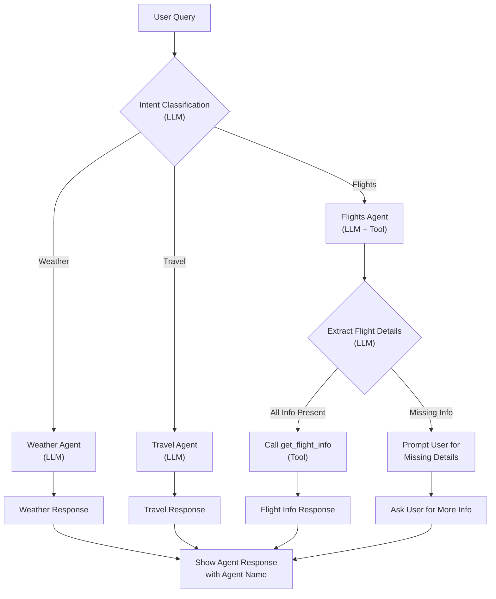
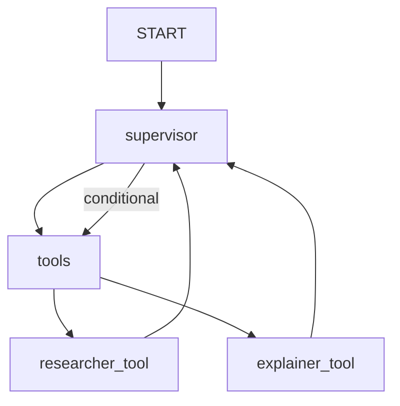

## Agentic AI Orchestration with Langchain: Flight, Weather, and Travel Agents

This extension demonstrates an agentic AI orchestration system using LangChain and OpenAI/Azure LLMs. The system is designed to handle user queries related to flights, weather, and travel information by routing them to specialized agents. Each agent uses either an LLM or a tool (function) to fulfill the user's request.

---

### Overview

- **multiagent_langchain.py**:  
  Implements three agents:
  - **Weather Agent**: Answers weather-related queries using the LLM.
  - **Travel Agent**: Provides travel tips and recommendations using the LLM.
  - **Flights Agent**: Uses a tool (`get_flight_info`) to fetch flight information, extracting details from user queries with the help of the LLM.

- **search_flights.py**:  
  Implements utility functions for:
  - Fetching IATA codes by country or city.
  - Extracting flight details from user queries using the LLM.
  - Fetching flight information from the Google Flights API.

---

### Agent Routing Logic

1. **User Query**: The system receives a natural language query from the user.
2. **Intent Classification**:  
   - The system uses LLM-based intent classifiers to determine if the query is about weather, travel, or flights.
3. **Agent Selection**:  
   - The query is routed to the appropriate agent:
     - **Weather Agent** for weather/climate/temperature queries.
     - **Travel Agent** for travel tips and recommendations.
     - **Flights Agent** for flight booking, schedules, or airfare queries.
4. **Parameter Extraction** (Flights Agent):  
   - If the query is about flights, the system uses the LLM to extract origin, destination, departure date, and return date.
   - If any required parameter is missing, the agent prompts the user to provide it.
5. **Tool Invocation**:  
   - The Flights Agent calls `get_flight_info` with the extracted parameters.
   - The Weather and Travel Agents generate responses using the LLM.
6. **Response**:  
   - The system returns the agent's answer, clearly indicating which agent responded.

---

### Flowchart Diagram



---

### Key Implementation Details

#### multiagent_langchain.py

- **Agent Initialization**:  
  Each agent is initialized with its respective tool and the LLM.
- **Intent Detection**:  
  Uses LLM-based classifiers (system prompts) to robustly detect user intent.
- **Agent Routing**:  
  The main loop routes queries to the correct agent and prints the agent's name with the response.

#### search_flights.py

- **IATA Code Lookup**:  
  Functions to get IATA codes by country or city from a JSON file.
- **Flight Info Extraction**:  
  Uses the LLM to extract structured flight details from user queries.
- **Flight Info Retrieval**:  
  Calls the Google Flights API (via SerpAPI) to fetch flight data.
- **Parameter Validation**:  
  If any required parameter is missing, returns a message indicating what is needed.

---

### Example Usage

**User:**  
> I want to fly from Mumbai to Tokyo next month.

**System:**  
- Extracts origin: Mumbai, destination: Tokyo, dates: missing.
- Prompts:  
  `[Flights Agent]: Please provide the following information for your flight search: departure date, return date.`

---

### Extending the System

- Add more agents for other domains (e.g., hotel booking, local events).
- Enhance extraction logic for more robust natural language understanding.
- Integrate additional APIs for richer information.

---

## Agentic AI Longgraph - Supervisor Agent Workflow

This project demonstrates an agentic workflow using LangGraph and LangChain, orchestrating multiple specialized agents (researcher and explainer) to answer user queries. The supervisor agent coordinates the use of these tools to provide comprehensive, aggregated answers.

### Functionality

- **Supervisor Agent**: Receives user queries and decides which tools (researcher, explainer) to invoke.
- **Researcher Agent**: Searches the internet for answers using DuckDuckGo.
- **Explainer Agent**: Explains concepts in simple terms, using examples and stories.
- **Tool Integration**: Both agents are exposed as tools and can be invoked by the supervisor.
- **Interactive Console**: Users can ask questions in an endless loop until they type `quit` to exit.

### Workflow Diagram



**Diagram Explanation:**  
- The workflow starts at `START` and moves to the `supervisor` agent.
- The `supervisor` agent sends queries to the `tools` node.
- The `tools` node can invoke either the `researcher_tool` (DuckDuckGo search) or the `explainer_tool` (simple explanations).
- Both tools return their results to the `supervisor`, which aggregates and presents the answer.
- Conditional edges allow the supervisor to decide which tools to use based on the query.

### Example Usage

Run the script and interact with the supervisor agent:

```
Ask a question (type 'quit' to exit): Explain the causes of the decline of the Roman Empire in a simple way, addressing a very young audience.
```

The supervisor agent will aggregate responses from both the researcher and explainer tools and present them in a single message.

---
