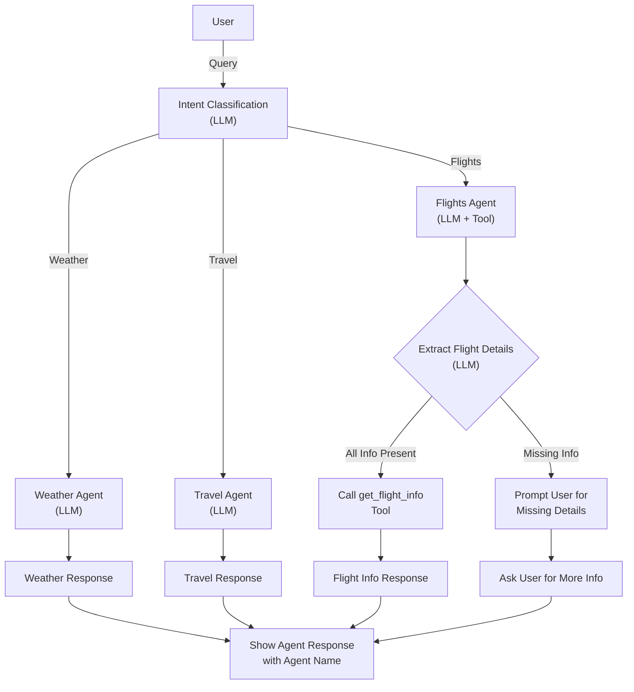

## Agentic AI Orchestration with Langchain: Flight, Weather, and Travel Agents

This extension demonstrates an agentic AI orchestration system using LangChain and OpenAI/Azure LLMs. The system is designed to handle user queries related to flights, weather, and travel information by routing them to specialized agents. Each agent uses either an LLM or a tool (function) to fulfill the user's request.

---

## Overview

- **multiagent_langchain.py**:  
  Implements three agents:
  - **Weather Agent**: Answers weather-related queries using the LLM.
  - **Travel Agent**: Provides travel tips and recommendations using the LLM.
  - **Flights Agent**: Uses a tool (`get_flight_info`) to fetch flight information, extracting details from user queries with the help of the LLM.

- **search_flights.py**:  
  Implements utility functions for:
  - Fetching IATA codes by country or city.
  - Extracting flight details from user queries using the LLM.
  - Fetching flight information from the Google Flights API.

---

## Agent Routing Logic

1. **User Query**: The system receives a natural language query from the user.
2. **Intent Classification**:  
   - The system uses LLM-based intent classifiers to determine if the query is about weather, travel, or flights.
3. **Agent Selection**:  
   - The query is routed to the appropriate agent:
     - **Weather Agent** for weather/climate/temperature queries.
     - **Travel Agent** for travel tips and recommendations.
     - **Flights Agent** for flight booking, schedules, or airfare queries.
4. **Parameter Extraction** (Flights Agent):  
   - If the query is about flights, the system uses the LLM to extract origin, destination, departure date, and return date.
   - If any required parameter is missing, the agent prompts the user to provide it.
5. **Tool Invocation**:  
   - The Flights Agent calls `get_flight_info` with the extracted parameters.
   - The Weather and Travel Agents generate responses using the LLM.
6. **Response**:  
   - The system returns the agent's answer, clearly indicating which agent responded.

---

## Flowchart Diagram

---

## Key Implementation Details

### multiagent_langchain.py

- **Agent Initialization**:  
  Each agent is initialized with its respective tool and the LLM.
- **Intent Detection**:  
  Uses LLM-based classifiers (system prompts) to robustly detect user intent.
- **Agent Routing**:  
  The main loop routes queries to the correct agent and prints the agent's name with the response.

### search_flights.py

- **IATA Code Lookup**:  
  Functions to get IATA codes by country or city from a JSON file.
- **Flight Info Extraction**:  
  Uses the LLM to extract structured flight details from user queries.
- **Flight Info Retrieval**:  
  Calls the Google Flights API (via SerpAPI) to fetch flight data.
- **Parameter Validation**:  
  If any required parameter is missing, returns a message indicating what is needed.

---

## Example Usage

**User:**  
> I want to fly from Mumbai to Tokyo next month.

**System:**  
- Extracts origin: Mumbai, destination: Tokyo, dates: missing.
- Prompts:  
  `[Flights Agent]: Please provide the following information for your flight search: departure date, return date.`

---

## Extending the System

- Add more agents for other domains (e.g., hotel booking, local events).
- Enhance extraction logic for more robust natural language understanding.
- Integrate additional APIs for richer information.

---